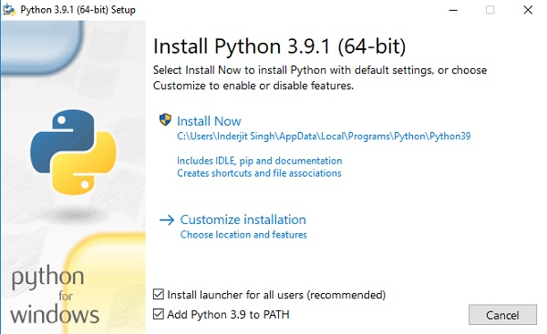
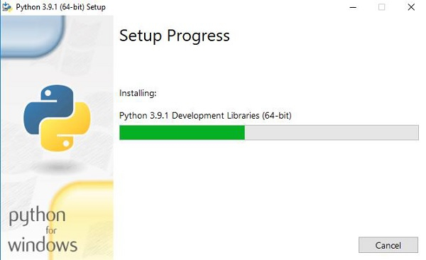
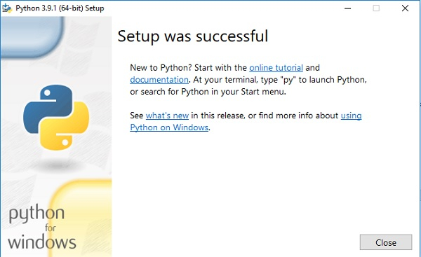
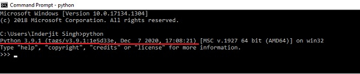
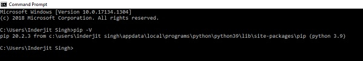

## Python Installation
1. Please download Python from official distribution 
https://www.python.org/downloads/

2. Please use the latest version
3. Launch downloaded package, Make sure to select both the checkboxes at the bottom and then click Install New.
    

    On clicking the Install Now, The installation process starts.
    

    The installation process will take few minutes to complete and once the installation is successful, 
    the following screen is displayed.
    
   

4. Verify that Python has been installed successfully:
- Open the command prompt.
- Type ‘python’ and press enter.
- The version of the python which you have installed will be displayed if the python is successfully installed on your windows.
  


5. Verify that Python-Pip is installed (PIP is a Python Package Manager)
- Open the command prompt.
- Enter pip –V to check if pip was installed.
- The following output appears if pip is installed successfully.
  
  

6. Install require packages (using pip)
- Open the command prompt.
- Navigate to directory when this project is located
- Run following command `python -m pip install -r requirements.txt`
- You should get following output:
```bash
    Collecting playwright
      Using cached playwright-1.21.0-py3-none-win_amd64.whl (27.7 MB)
    Collecting greenlet==1.1.2
      Downloading greenlet-1.1.2-cp37-cp37m-win_amd64.whl (101 kB)
         ---------------------------------------- 101.2/101.2 KB 644.8 kB/s eta 0:00:00
    Collecting typing-extensions
      Downloading typing_extensions-4.2.0-py3-none-any.whl (24 kB)
    Collecting pyee==8.1.0
      Using cached pyee-8.1.0-py2.py3-none-any.whl (12 kB)
    Collecting websockets==10.1
      Downloading websockets-10.1-cp37-cp37m-win_amd64.whl (97 kB)
         ---------------------------------------- 97.5/97.5 KB 5.8 MB/s eta 0:00:00
    Installing collected packages: pyee, websockets, typing-extensions, greenlet, playwright
    Successfully installed greenlet-1.1.2 playwright-1.21.0 pyee-8.1.0 typing-extensions-4.2.0 websockets-10.1
```

7. Run Test
- Open the command prompt.
- Navigate to directory when this project is located
- Run following command `python playwright-test.py`
- Test will open the wikipedia.org in Chrome Browser and search for "Boeing" phrase 
- You should get following output:
```bash
Windows
('64bit', 'WindowsPE')
AMD64
GDNLPDAPD456
Intel64 Family 6 Model 165 Stepping 2, GenuineIntel
Duration: 0:00:02.566018 [seconds]
```
